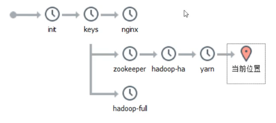
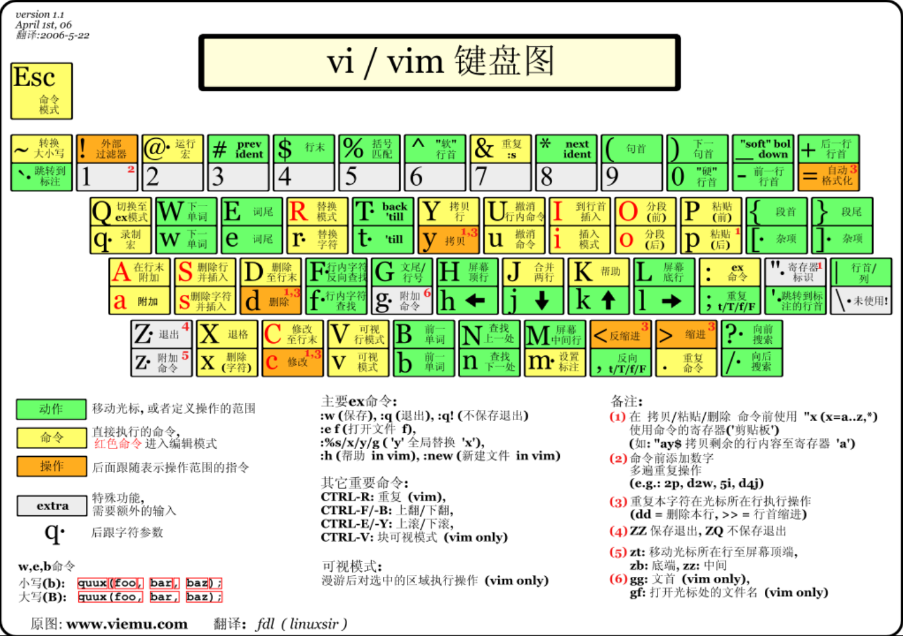
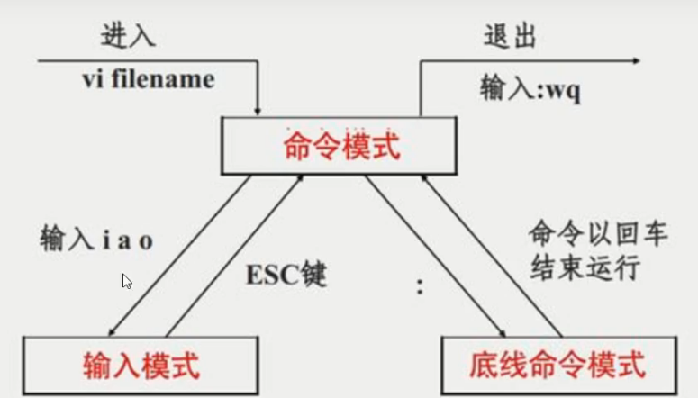

# CentOS7学习

## 一、下载安装

访问linux.org，选择centos，找到centos对应版本的镜像网站下载。

新建虚拟机

安装：

1. 语言默认英文，最好不要改动，不然有可能会有乱码问题。
2. 时区选择shanghai
3. 软件software，按需求选择，也可以默认安装minimal版本，其他软件后续单独安装。
4. 硬盘分区
   1. 选择“I will configure partioning”，自定义配置。
   2. 添加引导分区/boot，分配256M
   3. 添加交换空间swap，分配4096M（内存的两倍）
   4. 添加根目录/，分配剩余所有磁盘空间

5. 配置主机名host name
6. root用户设置密码
7. 重启

## 二、配置Linux

### 1、网络配置

vi /etc/sysconfig/network-scripts/ifcfg-ens33

sysconfig：系统配置

network-scripts：网络的脚本

ifcfg-ens33：ens33的网络网卡配置

```
--修改
ONBOOT=yes
BOOTPROTO=static	//静态网络IP	dhcp 动态网络获取IP
--添加
IPADDR=192.168.11.100	//1和2都不能用
NETMASK=255.255.255.0
GATEWAY=192.168.11.2
DNS1=114.114.114.114
--删除
UUID
```

虚拟机VMware-->编辑-->虚拟网络配置

查看NAT模式的子网IP和子网掩码。

点击NAT设置，查看网关

重启网卡重新加载配置文件

- ip addr
- systemctl restart network.service
- ping www.baidu.com
- ctrl+c 终止命令

### 2、配置虚拟机防火墙

防火墙保护本机端口不被别人访问

如果端口需要被别人访问，需要添加端口的防火墙例外

关闭防火墙：

- systemctl stop firewalld（本次服务内关闭防火墙，立即关闭仅本次生效）
- systemctl disable fireealld（下次重启后禁用防火墙服务，长期生效）

### 3、软件安装限制

vi /etc/selinux/config

 SELinux是部署在 Linux 上用于增强系统安全的功能模块。

修改：SELINUX=disabled

此举让SELinux不生效了，关闭它其实就是因为太麻烦了，Linux其实挺安全的了，但是它仍然设定了更多的条规，如果不是足够了解（读那个麻烦的要死的文档）它很可能会给你带来很多不确定因素，倒不如关了一了百了。

### 4、创建快照

虚拟机-->快照-->快照管理器

点击“拍摄快照”，对快照命名（如：base），添加描述。

### 5、克隆

链接克隆

- 当前节点文件夹只存储差异性数据
- 相同数据存放在原始节点上
- 优点：节省空间 缺点：耦合性大

完整克隆

- 就是基于原始节点完全拷贝到新节点的文件夹中
- 优点：耦合性低 缺点：硬盘空间使用大
- 推荐使用完整克隆



克隆出来的系统要修改ip和主机名。

输入hostname 新主机名  只能临时生效，可exit退出账户再登录查看，但重启后无效。

vi /etc/hostname	可彻底修改

## 三、Linux的文件系统

> **万事万物皆文件**

文件系统：操作系统如何管理文件，内部定义了一些规则或者定义。

在Linux中所有的东西都是以文件的方式进行操作

Linux维护着一个树状结构的文件模型：

- 只有一个根节点/
- 一个节点上可以有多个子节点

查找文件的方式：

- 相对路径
  - 以当前路径为基准点，查找其他资源
  - vi  ../etc/sysconfig/network
- 绝对路径
  - 以根目录为基准点，查找其他资源
  - vi /etc/sysconfig/network-scripts/ifcfg-ens33
- 日常使用中，只要找到路径即可，但是如果是一些配置文件，尽量写绝对路径

可以随意的挂载磁盘

- 如：mount /dev/disk1 /usr/download

### Linux 根目录（/）

1、一级目录

| 一级目录 | 功能（作用）                                                 |
| -------- | ------------------------------------------------------------ |
| /bin/    | 存放系统命令，普通用户和 root 都可以执行。放在 /bin 下的命令在单用户模式下也可以执行 |
| /boot/   | 系统启动目录，保存与系统启动相关的文件，如内核文件和启动引导程序（grub）文件等 |
| /dev/    | 设备文件保存位置                                             |
| /etc/    | 配置文件保存位置。系统内所有采用默认安装方式（rpm 安装）的服务配置文件全部保存在此目录中，如用户信息、服务的启动脚本、常用服务的配置文件等 |
| /home/   | 普通用户的主目录（也称为家目录）。在创建用户时，每个用户要有一个默认登录和保存自己数据的位置，就是用户的主目录，所有普通用户的主目录是在 /home/ 下建立一个和用户名相同的目录。如用户 liming 的主目录就是 /home/liming |
| /lib/    | 系统调用的函数库保存位置                                     |
| /media/  | 挂载目录。系统建议用来挂载媒体设备，如软盘和光盘             |
| /mnt/    | 挂载目录。早期 Linux 中只有这一个挂载目录，并没有细分。系统建议这个目录用来挂载额外的设备，如 U 盘、移动硬盘和其他操作系统的分区 |
| /misc/   | 挂载目录。系统建议用来挂载 NFS 服务的共享目录。虽然系统准备了三个默认挂载目录 /media/、/mnt/、/misc/，但是到底在哪个目录中挂载什么设备可以由管理员自己决定。例如，笔者在接触 Linux 的时候，默认挂载目录只有 /mnt/，所以养成了在 /mnt/ 下建立不同目录挂载不同设备的习惯，如 /mnt/cdrom/ 挂载光盘、/mnt/usb/ 挂载 U 盘，都是可以的 |
| /opt/    | 第三方安装的软件保存位置。这个目录是放置和安装其他软件的位置，手工安装的源码包软件都可以安装到这个目录中。不过笔者还是习惯把软件放到 /usr/local/ 目录中，也就是说，/usr/local/ 目录也可以用来安装软件 |
| /root/   | root 的主目录。普通用户主目录在 /home/ 下，root 主目录直接在“/”下 |
| /sbin/   | 保存与系统环境设置相关的命令，只有 root 可以使用这些命令进行系统环境设置，但也有些命令可以允许普通用户查看 |
| /srv/    | 服务数据目录。一些系统服务启动之后，可以在这个目录中保存所需要的数据 |
| /tmp/    | 临时目录。系统存放临时文件的目录，在该目录下，所有用户都可以访问和写入。建议此目录中不能保存重要数据，最好每次开机都把该目录清空 |

FHS 针对根目录中包含的子目录仅限于上表，但除此之外，Linux 系统根目录下通常还包含下表中的几个一级目录

> 注：FHS（Filesystem Hierarchy Standard），文件系统层次化标准，该标准规定了 Linux 系统中所有一级目录以及部分二级目录（/usr 和 /var）的用途。发布此标准的主要目的就是为了让用户清楚地了解每个目录应该存放什么类型的文件。

| 一级目录     | 功能（作用）                                                 |
| ------------ | ------------------------------------------------------------ |
| /lost+found/ | 当系统意外崩溃或意外关机时，产生的一些文件碎片会存放在这里。在系统启动的过程中，fsck 工具会检查这里，并修复已经损坏的文件系统。这个目录只在每个分区中出现，例如，/lost+found 就是根分区的备份恢复目录，/boot/lost+found 就是 /boot 分区的备份恢复目录 |
| /proc/       | 虚拟文件系统。该目录中的数据并不保存在硬盘上，而是保存到内存中。主要保存系统的内核、进程、外部设备状态和网络状态等。如 /proc/cpuinfo 是保存 CPU 信息的，/proc/devices 是保存设备驱动的列表的，/proc/filesystems 是保存文件系统列表的，/proc/net 是保存网络协议信息的...... |
| /sys/        | 虚拟文件系统。和 /proc/ 目录相似，该目录中的数据都保存在内存中，主要保存与内核相关的信息 |

### Linux /usr目录

usr（注意不是 user），全称为 Unix Software Resource，此目录用于存储系统软件资源。FHS 建议所有开发者，应把软件产品的数据合理的放置在 /usr 目录下的各子目录中，而不是为他们的产品创建单独的目录。

Linux 系统中，所有系统默认的软件都存储在 /usr 目录下，/usr 目录类似 Windows 系统中 C:\Windows\ + C:\Program files\ 两个目录的综合体。

| 子目录       | 功能（作用）                                                 |
| ------------ | ------------------------------------------------------------ |
| /usr/bin/    | 存放系统命令，普通用户和超级用户都可以执行。这些命令和系统启动无关，在单用户模式下不能执行 |
| /usr/sbin/   | 存放根文件系统不必要的系统管理命令，如多数服务程序，只有 root 可以使用。 |
| /usr/lib/    | 应用程序调用的函数库保存位置                                 |
| /usr/XllR6/  | 图形界面系统保存位置                                         |
| /usr/local/  | 手工安装的软件保存位置。我们一般建议源码包软件安装在这个位置 |
| /usr/share/  | 应用程序的资源文件保存位置，如帮助文档、说明文档和字体目录   |
| /usr/src/    | 源码包保存位置。我们手工下载的源码包和内核源码包都可以保存到这里。不过笔者更习惯把手工下载的源码包保存到 /usr/local/src/ 目录中，把内核源码保存到 /usr/src/linux/ 目录中 |
| /usr/include | C/[C++](http://c.biancheng.net/cplus/) 等编程语言头文件的放置目录 |

### Linux /var 目录

/var 目录用于存储动态数据，例如缓存、日志文件、软件运行过程中产生的文件等。

| /var子目录        | 功能（作用）                                                 |
| ----------------- | ------------------------------------------------------------ |
| /var/lib/         | 程序运行中需要调用或改变的数据保存位置。如 [MySQL](http://c.biancheng.net/mysql/) 的数据库保存在 /var/lib/mysql/ 目录中 |
| /var/log/         | 登陆文件放置的目录，其中所包含比较重要的文件如 /var/log/messages, /var/log/wtmp 等。 |
| /var/run/         | 一些服务和程序运行后，它们的 PID（进程 ID）保存位置          |
| /var/spool/       | 里面主要都是一些临时存放，随时会被用户所调用的数据，例如 /var/spool/mail/ 存放新收到的邮件，/var/spool/cron/ 存放系统定时任务。 |
| /var/www/         | RPM 包安装的 Apache 的网页主目录                             |
| /var/nis和/var/yp | NIS 服务机制所使用的目录，nis 主要记录所有网络中每一个 client 的连接信息；yp 是 linux 的 nis 服务的日志文件存放的目录 |
| /var/tmp          | 一些应用程序在安装或执行时，需要在重启后使用的某些文件，此目录能将该类文件暂时存放起来，完成后再行删除 |

## 四、Linux的命令

### 1.文件的操作命令

- cd
  - 改变当前工作目录
- ls    ll
  - 显示出指定目录下所有的文件
  - 文件的类型
    - -普通文件
    - d文件夹
    - l软连接
  - -rw-r--r--. 1 root root 3384 Nov 11 23:25 install.log.syslog
- mkdir
  - 创建文件目录
  - mkdir -p a/b/c/d/e/f 会自动创建文件父目录
  - mkdir -p aaa/{1,2,3}ls 一次可以创建多个子目录1ls,2ls,3ls
- rmdir
  - 删除空文件夹
    - rmdir:failed to remove 'a1': Directory not empty
    - rmdir:failed to remove 'baidu': Not a directory
  - 可以安全的删除文件目录
- cp
  - 拷贝文件或者文件目录
  - cp 源文件 目标目录
    - cp abcd /opt
    - cp /opt/abcd ./
  - 拷贝文件夹
    - cp -r abc /opt  （-r是递归的意思）
    - 拷贝文件夹下所有的内容
    - cp: omitting directory '/root/a1'
- mv
  - 移动文件或者文件夹
    - mv a1 /opt
    - mv abc /opt
  - 修改文件名称
    - mv a abcd
- rm
  - 删除文件
    - rm install.log
    - rm -f install.log  （-f强制删除）
  - 删除文件夹
    - rm -r abcd
    - rm -rf abcd **谨慎使用**
- touch
  - 如果没有就创建一个文件
  - 如果该文件已经存在，修改文件的三个时间，将三个时间改为当前时间
- stat
  - 查看文件的状态
  - Inode当前文件在文件系统的唯一标识，类似于ID
  - 时间
    - access访问时间
    - modify修改文件内容时间
    - change修改文件元数据信息时间
      - 文件大小，文件所有者，文件权限
      - 对于文件的描述信息
- ln
  - 创建文件的链接
  - 软（符号）链接
    - ln -s a1 sl
    - 软连接和原始文件不是同一个文件
      - a1  67170161
      - sl   67170154
    - 软连接指向的是那个路径，如果源文件删除或改名了就找不到了，如果再建一个同名的文件，inode不同软连接也将指向这个新文件。
    - rm -rf sl
  - 硬链接
    - ln a2 hl
    - 硬链接和原始文件使用文件系统中的同一个文件
    - 硬链接与源文件指向的是同一块硬盘空间只认inode，如果删除了源文件，硬链接仍然可以找到这块硬盘空间，如果建立同名文件，这个新文件是指向新的硬盘空间新的inode，与前文件和硬链接无关
    - 如果你害怕一个文件被别人误删，你可以使用硬链接保护这个文件
  - 软硬链接在链接文件的时候，推荐使用文件的绝对路径，否则有可能会出现问题

### 2.文件的读取命令

- cat
  - 将整个文档加载到内存中，并进行一次性显示
  - 除非后面使用管道，传递数据
- tac
  - 将整个文档加载到内存中，并进行一次性按行逆序显示
- more less
  - 分页查看文档内容
  - 快捷键
    - 回车  下一行
    - 空格  下一页
    - b  回退
    - q  退出
- head
  - 从文章开始读取N行
  - 默认如果超过10行读取10行，否则读取现在行数
  - head -5 profile
- tail
  - 从文章末尾读取N行
  - head -3 profile | tail -1
    - 利用管道只读取第N行
    - 管道的作用就相当于把前面的结果以参数的方式传递给后面的命令
  - 读取新增数据
    - ping www.baidu.com >> baidu
    - tail -F baidu
    - 如果f：
      - 它会监听inode的文件数据变化，但是当文件被删除后
      - 即使新创建，inode也会发生变化，于是监听失败
    - 如果F：
      - 他会监听指定名字的文件，如果文件被删除后，重新创建
      - 他会重新监听新文件的数据变化，监听不受影响
- find
  - 查找指定的文件
  - find 要查找的范围 -name 名字
  - find /etc -name profile

## 五、VI和VIM编辑器

### 1.打开文件

- 正常打开
  - vi profile
- 打开文件，并将光标置于第8行
  - vi +8 profile
- 打开最后一行
  - vi + profile
  - 按n查找下一个，按N查找上一个
- 打开指定搜索单词的位置
  - vi +/if profile

### 2.三种模式

- 编辑模式
  - 编辑模式中，每一个按键都有其他的功能
- 输入模式
  - 每一个按键按下什么，就向文本中输入什么
- 末行（命令行）模式
  - 可以直接在vi中输入特定的命令





- 编辑模式-->输入模式
  - i在当前位置插入数据
  - a追加数据
  - o在当前行后面开启一个新的输入行
  - I行首
  - A行尾
  - O上一行
- 输入模式-->编辑模式
  - 按下ESC
- 编辑模式-->末行模式
  - 按下：
- 末行模式-->编辑模式
  - 按下ESC

### 3.编辑模式

- G最后一行
- gg跳转到第一行
- 数字gg跳转到第数字行
- w下个单词
- 数字w
- dw删除一个单词
- 3dw删除三个单词
- dd 删除一行
- 3dd删除三行
- u回退到前面的操作
- .回退u执行的操作
- yw复制一个单词
- 3yw复制三个单词
- yy复制一行
- 3yy复制三行
- p粘贴
- 6p粘贴6次
- x剪切
- 3x剪切三个字符
- r替换，然后输入一个字符替换
- 3r替换三个
- hjkl方向键
- ZZ保存并退出
- ctrl+s锁屏 ctrl+q解锁

### 4.末行模式

- set nu 设置行号
- set nonu 取消行号
- w保存
- q退出
- wq保存并退出
- q! 强制退出，但是不保存
- 如果上次异常退出会保留同名隐藏文件，每次启动会给与提示
  - 如果确定当前文件没问题，请删除隐藏文件
- /pattern
  - /搜索指定的字符串
  - /usr n向下查找 N逆向查找
- s/p1/p2/g
  - p1替换成字符串p2
  - g替换当前行所有  没有g只替换当前行第一个
    - s/abc/xyz/g
  - 查找指定行
    - 3,8s/abc/xyz/g
  - 替换全文
    - g/abc/s//xyz/g