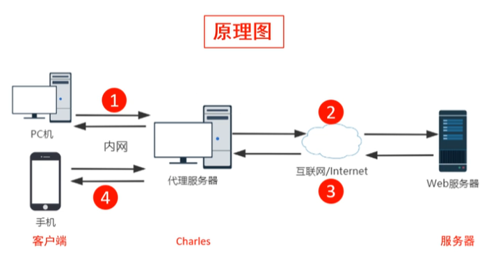

# Charles抓包工具实战

## 一、Charles简介

### 1、Charles是什么

Charles中文名是青花瓷，它是一款基于HTTP协议的代理服务器，通过成为电脑或者浏览器的代理，然后截取请求和请求结果达到分析抓包的目的。

**特点：**跨平台、半免费（免费版有限制）

### 2、Charles工作原理

前置步骤：

1. 需要运行Charles并配置代理
2. 在客户端上需要配置代理

步骤：

### 3、Charles主要功能

### 4、Charles优点

## 二、Charles安装与配置

## 三、Charles实战