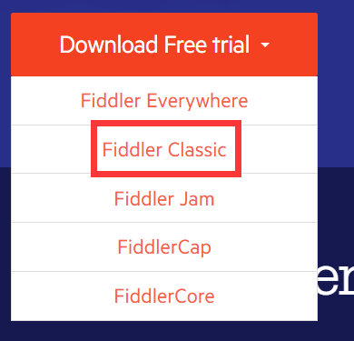
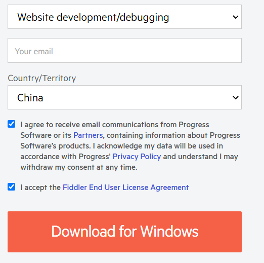
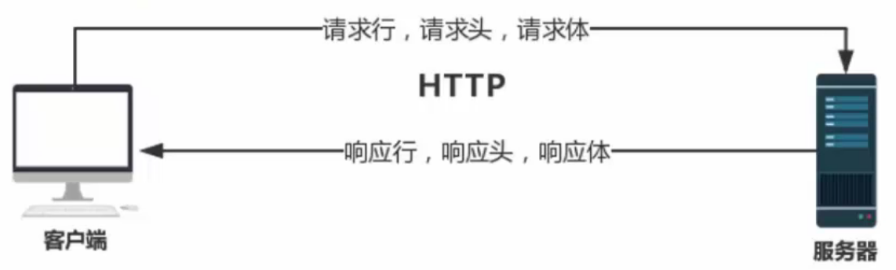

# Fiddler抓包工具

## 一、下载安装

### 1.下载

官网链接：https://www.telerik.com/



Fiddler Classic（经典版），这个版本是**免费**的，不过只能在Windows上使用。

Fiddler Everywhere可以在所有平台使用，并且相当于Fiddler Classic+postman，但是是**收费**的。

如果只作为抓包工具经典版就够用了，可以直接点击下方链接前往下载页面。

下载链接：https://www.telerik.com/download/fiddler



填好信息之后勾选这两项，点击**下载**。

### 2.安装

点击同意后选择安装路径安装。

## 二、抓包

### 1.基础操作

#### 1.1抓取请求

- 界面左侧Web Sessions会话列表中的是HTTP数据包。

- 界面右侧Inspectors中，上边是Request请求信息，下边是Response响应信息。

#### 1.2删除请求

- 方法1：点击工具栏中的×，删除请求。

- 方法2：session列表下的黑框QuickExec中输入cls或clear删除请求。

#### 1.3过滤请求

- 点击右侧选项卡中的Filters
- 勾选User Filters
- Host Filter选择Show only the following Hosts
- 在下方框中填入想要过滤查看的主机地址，以“;”分隔。
- 点击Actions，选择Run filterset now

#### 1.4抓取HTTPS

默认只抓取HTTP协议的网页，想抓取HTTPS则需要：

- 打开Tools--Options--HTTPS选项卡
- 勾选Capture HTTPS CONNECTs
- 勾选Decrypt HTTPS traffic
- 勾选Ignore server certificate errors(unsafe)忽略证书（如果不安装fiddler证书就如此）

### 2.HTTP请求与响应



### 3.典型应用

- web网页、手机APP抓包

- 修改服务请求与响应

- 前端性能分析及优化

- 模拟弱网测试

## 三、应用场景

- 通过抓包工具截取观察网站的请求信息，更深入了解网站
- 通过用抓包工具截取、观察网站的请求与返回信息，帮助我们进行BUG的定位于描述
- 通过抓包工具拦截修改请求信息，绕过界面的限制，测试服务端的功能

### 1.辅助定位bug

- 抓到HTTP数据包
- 检查请求方式与接口地址是否有误
- 检查返回的响应状态是否正常
- 点击请求的WebForms，检查接口传递参数
- 点击响应的JOSN检查接口返回的响应数据

### 2.构建模拟测试场景

- 模拟发送请求，进行接口测试
  - 应用场景1：需求文档中说明，某个接口限制同一个账号只能请求一次，同一个设备只能请求一次
  - 应用场景2：存在页面输入限制，需要模拟特殊情况请求（例如特殊字符，空格等参数），测试程序处理机制
- Mock接口返回数据，测试程序
  - 应用场景1：需要验证接口数据能否正常处理，但程序处于开发过程中，后台无法对发送请求给出响应
  - 应用场景2：需要验证程序针对404，500，502等不同状态的处理机制

#### 2.1模拟发送请求

- 点击Composer
- 设置请求方法，请求地址、协议
- 设置请求header
- 设置请求body
- 发送请求
- 查看响应

#### 2.2模拟返回相应数据

- 点击AutoResponder
- 选择请求，点击Add Rule添加规则
- Rule Editor中选择响应方式
- Save
- 勾选三个选项
  - Enable rules
  - Unmatched requests passthrough
  - Enable Latency

### 3.模拟弱网环境操作

> 进地铁、上公交、进电梯等，如果app没有对各种网络异常进行兼容处理，那么用户可能在日常生活中遇到APP闪退、ANR、数据丢失等问题。

- 启动模拟调制解调器速度来模拟弱网

  - Rules--Performance--Simulate Modem Speeds

- Customize Rules（Ctrl+R）自定义规则

  - ```js
    if (m_SimulateModem) {
                // Delay sends by 300ms per KB uploaded.
                oSession["request-trickle-delay"] = "300"; 
                // Delay receives by 150ms per KB downloaded.
                oSession["response-trickle-delay"] = "150"; 
            }
    ```

- 延迟参数

  - | 网络环境                       | 上/下行带宽（kbps） | 上/下行丢包率（%） | 上/下行延迟（ms） | DNS延迟（ms） |          备注          |
    | ------------------------------ | ------------------- | ------------------ | ----------------- | ------------- | :--------------------: |
    | 2G                             | 20/50               | 0/0                | 500/400           | 0             |                        |
    | 3G                             | 330/2000            | 0/0                | 100/100           | 0             |                        |
    | 4G                             | 40000/80000         | 0/0                | 15/10             | 0             |                        |
    | wifi                           | 33000/40000         | 0/0                | 1/1               | 0             |                        |
    | 带宽有限环境                   | 32/32               | 0/0                | 200/100           | 0             |                        |
    | 低丢包率、低时延的环境（上行） | 33000/40000         | 10/0               | 100/100           | 200           | WiFi环境下即可设置测试 |
    | 低丢包率、高时延的环境（上行） | 33000/40000         | 10/0               | 350/350           | 350           |         、、、         |
    | 低丢包率、低时延的环境（下行） | 33000/40000         | 0/10               | 100/100           | 200           |         、、、         |
    | 低丢包率、高时延的环境（下行） | 33000/40000         | 0/10               | 350/350           | 350           |         、、、         |
    | 低丢包率、低时延的环境         | 33000/40000         | 10/10              | 100/100           | 200           |         、、、         |
    | 低丢包率、高时延的环境         | 33000/40000         | 10/10              | 350/350           | 350           |         、、、         |
    | 高丢包率的环境（上行）         | 33000/40000         | 90/0               | 100/100           | 200           |         、、、         |
    | 高丢包率的环境（下行）         | 33000/40000         | 0/90               | 100/100           | 200           |         、、、         |
    | 高丢包率的环境                 | 33000/40000         | 90/90              | 100/100           | 200           |         、、、         |
    | 网络超时（响应）               | 33000/40000         | 0/100              | 100/100           | 200           |         、、、         |
    | 网络超时（请求）               | 33000/40000         | 100/0              | 100/100           | 200           |         、、、         |
    | 网络超时（完全丢包）           | 33000/40000         | 100/100            | 100/100           | 200           |         、、、         |
    | 无网（飞行模式或关闭网络）     |                     |                    |                   |               |                        |

### 4.前端性能分析及优化

- 选中想查看的session列表
- 点击Statistics进行数据统计
- 点击Collapse Chart即可查看所用语言的所占比
- 点击Timeline即可查看页面各个元素的加载时间和顺序


## 问题解决

### Q1.Fiddler启动后Chrome浏览器无法浏览网页？

1. 打开Tools--Options--HTTPS选项卡；
2. 点击Actions下拉选择Trust Root Certificate，弹框选yes，弹框选是（到这一步可能就解决了）；
3. 点击Actions下拉选择Export Root Certificate to Desktop，将fiddler证书导出到桌面；
4. 打开谷歌浏览器，设置--高级--安全--管理证书；
5. 导入证书
6. 重启浏览器与fiddler。