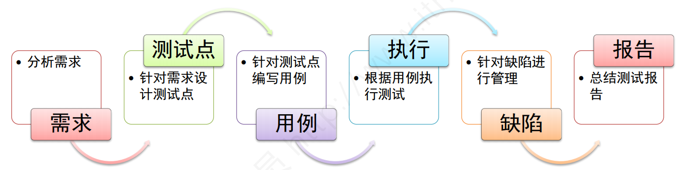
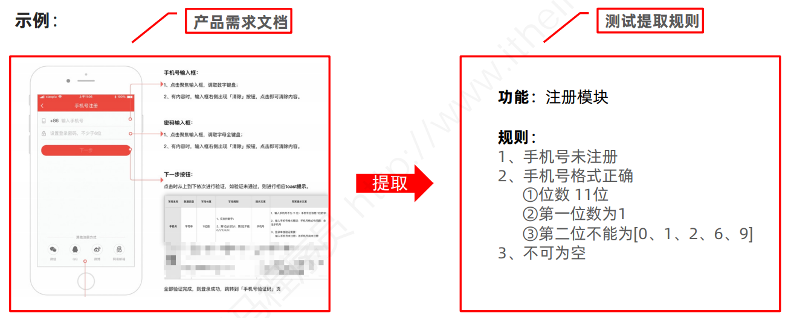
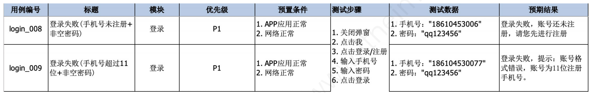
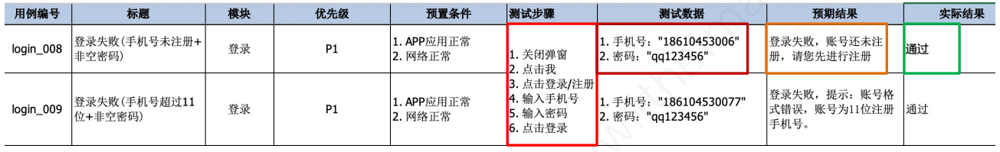
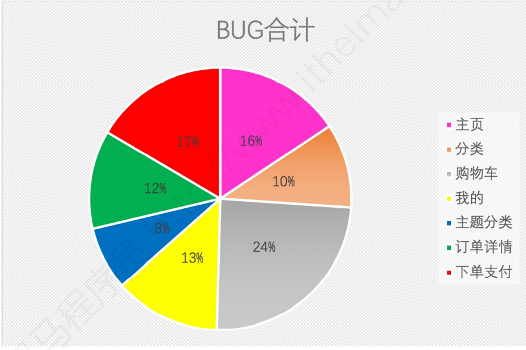

# 软件测试入门

## 一、测试怎么做

### 1、需求分析

说明：根据产品需求文档，提取出规则要求。

为什么要进行提取规则要求？

- 明确软件有哪些功能和要求

- 为设计测试点做准备

### 2、设计测试点

测试点：要进行验证的点，根据需求规则设计测试点。

规则： 

1、手机号未注册 

2、手机号格式正确 

① 位数 11位 

②第一位数为1 

③第二位不能为[0、1、2、6、9] 

3、不可为空 

测试点示例：

- 正确： ① 11位+未注册+正确格式（第一位1、第二位3） ② ... 

- 错误： ① 手机号已注册 ② ... 

为什么要设计测试点？

- 防止测试时有遗漏
- 为编写测试用例做准备

### 3、测试用例

将测试点转为测试执行的文档。

为什么要这么编写用例？

- 指导测试点正确测试实施
- 为执行测试做准备

### 4、用例执行

说明：执行用例就是执行测试。

测试步骤执行结果 = 预期结果 通过

测试步骤执行结果 != 预期结果 不通过

### 5、缺陷管理

说明：当执行用例结果和预期结果不符时为缺陷，就需要对缺陷进行管理

为什么需要对缺陷进行管理？

-  测试的目的就是减少软件缺陷（提交缺陷->等待修复->验证缺陷）
- 为测试报告做准备

### 6、测试报告

说明：对于本次执行测试缺陷进行分析统计，对于本次测试实施进行总结。

 主要内容：

 1、缺陷统计 

2、缺陷分析 

3、遗留缺陷 

4、测试总结

### 总结

测试怎么做： 

① 分析需求 – 明确需求，**梳理规则**

 ② 针对需求设计测试点 – **测试点可以根据设计方法进行 高效设计**

③ 针对测试点编写测试用例 

④ 执行测试用例- 根据用例文档**测试步骤**执行，**对比**预期结果，来决定用例执行是否通过。 

⑤ 缺陷管理-提交缺陷、跟踪缺陷、**验证缺陷** 

⑥ 总结测试报告- **统计缺陷**，总结本次测试执行为下次测试积累经验

